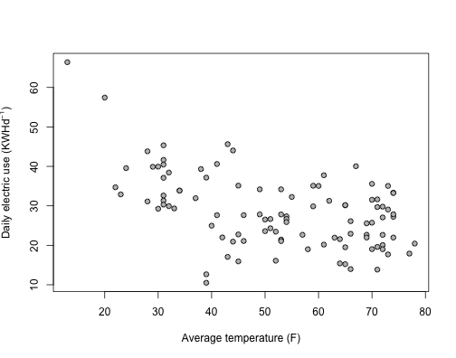
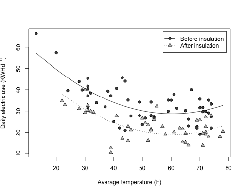

# A demonstration of using markdown and knitr with R studio
#### Eric Nord, Dept. of Biology, Greenville College

The recently released version of RStudio (0.96.122) has integrated the knitr package to allow easy use markdown to produce dynamic reports. Here we'll briefly explore the possibilities.
For some time I have been caught on the issue of how I document my work in R. Ideally, I want to have my code, and the statistical output and figures all accessible, but I've had no good way to do this. My requirements:  
1. Code and commentary stored in one file  
    a. both data manipulation and analysis code stored  
    b. ability to have extensive commentary w/o commenting out every line  
    c. ability to keep code that is not run for reference  
2. Statistical output and figures easily kept with the code that produced them  
3. Easy to go back and re-run or update analyses  

Pasting output and figures into a word processor document  *sort of* works, but it has several flaws, the most obvious of which is that it is not easy to re-run code from there. I got around this by keeping a comprehensive code file and a "results" file that statistical output and figures, as well as commentary went into.

## THERE IS A BETTER WAY!
Using markdown and knitr in RStudio makes it almost trivially easy to put this all in **one** (sort of) file. The markdown file is easily readable plain text (like this file) and can contain R code in discrete "chunks". Knitr will process the markdown file into an HTML file that includes the code and the output from that code. Knitr options allow the user to specify whether code chunks are evaluated, (if something didn't work but you want to keep a record of how you tried it, a chunk that isn't evaluated is perfect), and whether the code itself is shown in the HTML file (perfect for figures).

### Getting stated with markdown
In the RStudio editor pane choose *File>New>R Markdown*. You may be prompted to install the knitr package, in which case type ` install.packages("knitr",dep=T)`. (Note the format in the markdown file here - this is an *inline code chunk*, and in the HTML file the text will be formatted as code). Markdown is a simple markup language - clink the "MD" button on the toolbar above the editor pane for a quick reference sheet. To insert a code chunk choose *Chunks>Insert Chunk* from the "Chunks" menu on the editor toolbar.

---
### Demonstration: Analysis of Electrical Usage
I keep track of electrical usage for some reason. What can I learn about my household electrical use? I'll insert a chunk here to get some data. 
[*Note:* the {r load-data} in the code chunk means evaluate this with R, and the name of the chunk is "load-data"]

```r
# setwd('~/Documents/Stats/EssentialR/Code Files')
elec <- read.delim("../Data/electric bill.txt")
dim(elec)
```

```
## [1] 101   9
```

```r
head(elec)
```

```
##   month year  kwh days est   cost avgT dT.yr   kWhd.1
## 1     8 2003  476   21   a  33.32   69    -8 22.66667
## 2     9 2003 1052   30   e 112.33   73    -1 35.05172
## 3    10 2003  981   28   a  24.98   60    -6 35.05172
## 4    11 2003 1094   32   a  73.51   53     2 34.18750
## 5    12 2003 1409   32   a  93.23   44     6 44.03125
## 6     1 2004 1083   32   a  72.84   34     3 33.84375
```
We have a data frame with 101 rows and 9 columns. How has daily electric usage (kWhd.1) changed over the years?
This code chunk will create a graph for us:

```r
plot(elec$kWhd.1, type = "l", xlab = "month of residence", ylab = expression(paste("Daily electric use (KWH", 
    d^-1, ")")))
abline(v = c(0, 12, 24, 36, 48, 60, 72, 84, 96) + 5.5, lty = 3)  # add vertical lines at the end of each year.
```

 

There is a pretty strong seasonal pattern, but there is a lot of month-to-month variability also. Some of this is because they only read our meter every two months, and send us an "estimated" bill between months. There is a lot we could do with this data, but for now let's see how daily use is related to temperature (our house has electric heat, but no AC).
[*Note:* the {echo=FALSE} in the code chunk means don't show the code, just run it. Avoid periods and spaces in the chunk options]
 

There is clearly a relationship, though noisy. Let's try a regression. (Hint Ctrl+Alt+< (Mac: Cmd+Opt+<) insetes a new chunk)

```r
m1 <- lm(kWhd.1 ~ avgT, data = elec)
summary(m1)
```

```
## 
## Call:
## lm(formula = kWhd.1 ~ avgT, data = elec)
## 
## Residuals:
##     Min      1Q  Median      3Q     Max 
## -22.042  -4.756  -1.171   5.289  26.447 
## 
## Coefficients:
##             Estimate Std. Error t value Pr(>|t|)    
## (Intercept) 43.65856    2.66507  16.382  < 2e-16 ***
## avgT        -0.28503    0.04855  -5.871 5.79e-08 ***
## ---
## Signif. codes:  0 '***' 0.001 '**' 0.01 '*' 0.05 '.' 0.1 ' ' 1
## 
## Residual standard error: 8.067 on 99 degrees of freedom
## Multiple R-squared:  0.2583,	Adjusted R-squared:  0.2508 
## F-statistic: 34.47 on 1 and 99 DF,  p-value: 5.79e-08
```
A significant relationship with a very low p-value of 0 but low explanatory power (R^2 ) of 0.2507743. Might there be an increase in electric use in very hot weather with all the fans running? This model here would be (Note we can add display equations!):

$$ Y = a+bX+cX^2 $$


```r
m2 <- lm(kWhd.1 ~ avgT + I(avgT^2), data = elec)
summary(m2)
```

```
## 
## Call:
## lm(formula = kWhd.1 ~ avgT + I(avgT^2), data = elec)
## 
## Residuals:
##      Min       1Q   Median       3Q      Max 
## -19.9935  -5.2150   0.2497   5.7079  17.2228 
## 
## Coefficients:
##              Estimate Std. Error t value Pr(>|t|)    
## (Intercept) 72.684266   7.077983  10.269  < 2e-16 ***
## avgT        -1.590675   0.302012  -5.267 8.22e-07 ***
## I(avgT^2)    0.013048   0.002985   4.371 3.08e-05 ***
## ---
## Signif. codes:  0 '***' 0.001 '**' 0.01 '*' 0.05 '.' 0.1 ' ' 1
## 
## Residual standard error: 7.417 on 98 degrees of freedom
## Multiple R-squared:  0.3793,	Adjusted R-squared:  0.3666 
## F-statistic: 29.94 on 2 and 98 DF,  p-value: 7.107e-11
```
Indeed there is. This improves the R^2 quite a bit to 0.367. (Note that use of `signif()` to control digits in the *R*^2^ here)
In April of 2008 (month 57 of occupancy) we added insulation to the attic. Has this helped?

```r
elec$insul <- rep(0, nrow(elec))
elec$insul[57:nrow(elec)] <- 1  # create a boolean for insulation
m3 <- lm(kWhd.1 ~ avgT + I(avgT^2) + insul, data = elec)
summary(m3)
```

```
## 
## Call:
## lm(formula = kWhd.1 ~ avgT + I(avgT^2) + insul, data = elec)
## 
## Residuals:
##      Min       1Q   Median       3Q      Max 
## -14.4545  -3.7663   0.1781   3.4480  13.0452 
## 
## Coefficients:
##              Estimate Std. Error t value Pr(>|t|)    
## (Intercept) 75.183492   5.400137  13.923  < 2e-16 ***
## avgT        -1.537029   0.230163  -6.678 1.52e-09 ***
## I(avgT^2)    0.012708   0.002274   5.588 2.11e-07 ***
## insul       -9.613501   1.134049  -8.477 2.57e-13 ***
## ---
## Signif. codes:  0 '***' 0.001 '**' 0.01 '*' 0.05 '.' 0.1 ' ' 1
## 
## Residual standard error: 5.651 on 97 degrees of freedom
## Multiple R-squared:  0.6434,	Adjusted R-squared:  0.6324 
## F-statistic: 58.35 on 3 and 97 DF,  p-value: < 2.2e-16
```
This improves the R^2 even more to 0.6324138. Considering all the "estimated bills" and the noise they introduce, that is pretty good! Insulation has saved us about -9.614 KWH per day! Let's plot this:
 

One of the great advantages of this method of documenting your work is that you can easily update this (like when I get around to adding the newer bills I can see if the new water heater and fridge are saving even more electricity!) by updating the data file and running the analysis again. Most of the important conclusions are in inline code chunks, so R just updates them too.

### A few extra notes
- Early in this file is an "r options" line that sets some options for figure size and code decoration. It is optional of course. The `cache=TRUE` option speeds up knitting, but can cause surprise errors - use at your own risk.
- If I had chunks of code I dind't want to run, but wanted to keep for future reference, I'd just add `eval=FALSE` to the chunk options line.
- Notice that the markdown file is just plain text. R only will evaluate what is in the *code chunks* when you click the "Knit HTML" button. However, just like an R editor document, you can run lines from a code chunk by pressing ```Control+Enter (Command+Enter on a Mac)``. You can also run the entire code chunk by choosing *"Run current chunk"* from the *"Chunks"* menu on the editor toolbar. Notice that there is also a chunk browser on the bottom of the editor window. This is also useful, especially if you name your chunks.
- There are tools to convert this HTML file into a pdf if you need to. Or you could learn LaTeX....
- knitr makes png files for all the figures. They're in the "figure" folder where the markdown (.Rmd) file lives. For some reasong the background on all of them is grey. If you want to use these files, add a `par(bg="white")` line to your plotting chunks.
- The R workspace is not shared with the code run when knitting the HTML file, so you have to make sure **all** the necessary code is in your chunks.


### For more information
**RStudio** has some basic info http://www.rstudio.org/docs/authoring/using_markdown
**Wikipedia** has an article on markdown here http://en.wikipedia.org/wiki/Markdown
**Texts is an** editor for Mac and Windows that can handle Markdown http://www.texts.io/
The **knitr** help page online has much information about R chunk options http://yihui.name/knitr/options
A recent post on  **R bloggers** has a great example also http://www.r-bloggers.com/example-reproducile-report-using-r-markdown-analysis-of-california-schools-test-data/
